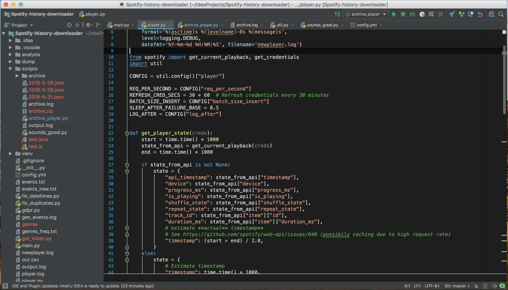

Visual Studio Dark Theme for IDEA Intellij
============================================

A replica of Visual Studio's dark theme for Intellij

This theme is based off Visual Studio and Visual Studio code.

## Installation

- Download [/settings.jar](/settings.jar)
- In Intellij, go to File -> Import Settings
- Select the settings.jar file you downloaded and press OK.

Intellij will then restart before applying the color theme. If the theme is not automatically applied, go to File -> Settings and then Editor -> Colors & Fonts and select the theme manually (Visual Studio).

## Supported Languages

Currently, the theme will work with:

- Java
- JavaScript
- TypeScript and CoffeeScript
- Groovy (with grails support)
- Python
- Kotlin
- HTML, CSS, Less, Sass/SCSS
- Templating Languages (GSP, JSP...)
- ActionScript
- Batch Script
- Cucumber
- SQL
- XML and XSLT
- JSON and YAML

and more!

## Issues and contributing
Please open a github issue for any problems you find. If possible add a screenshot to the issue as this makes it easy to see the problem.
